<h1 align="center">Hi there 👋, I'm Suhejl</h1>

  <b>DevOps | Cloud | Infrastructure as Code | Automation</b>

### 🛠️ Tech Stack & Tools

   
  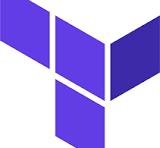 
   
  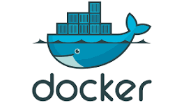 
   
   
  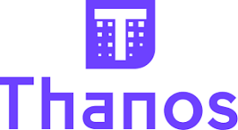 
  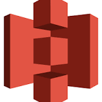 
  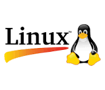 
  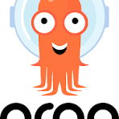 
   
   
  

---

### ☁️ AWS Services

   
  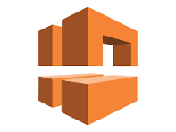 
   
   
   
  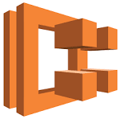 
  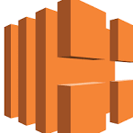 
  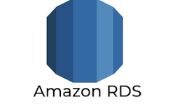 
  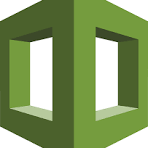 
  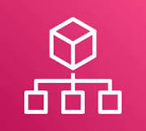 
   
  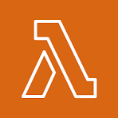

<!-- ---

### 📊 GitHub Stats

  

--- -->
